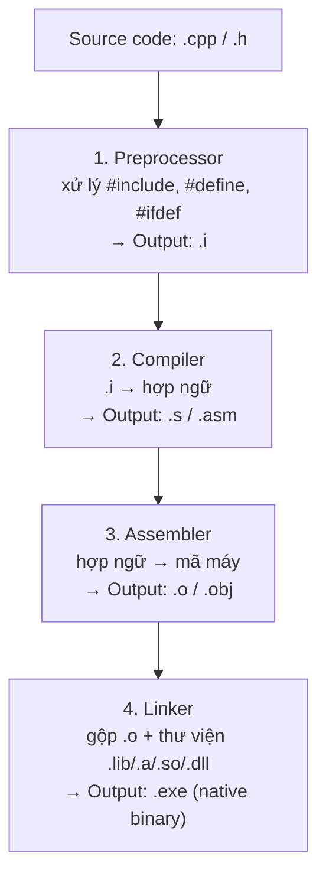
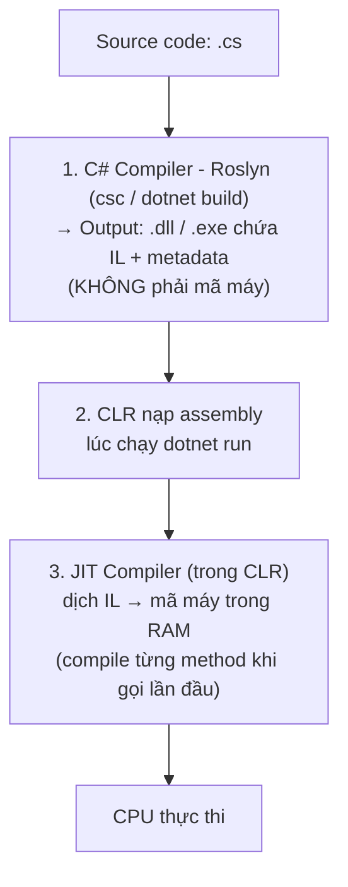

# C# vs C++ — Những điểm khác biệt chính

> Góc nhìn: người đã biết C++, chuyển sang C# cho WinForms / WPF.

---

## 0. Compile & Build Pipeline — khác biệt gốc rễ (đọc trước tiên)

Đây là khác biệt nền tảng nhất, giải thích tại sao mọi thứ phía sau (linking, thư viện, tốc độ chạy...) lại khác nhau.

### C++ — biên dịch thẳng ra máy (Ahead-of-Time, AOT), 4 bước



| Bước | Công cụ | Input | Output | Việc làm |
|---|---|---|---|---|
| 1. Preprocessing | `cpp` (preprocessor) | `.cpp`, `.h` | `.i` | Thay `#include`, expand `#define`, xử lý `#ifdef` |
| 2. Compilation | `cc1`/compiler proper | `.i` | `.s` (assembly) | Dịch C++ → hợp ngữ (chưa phải mã máy) |
| 3. Assembly | Assembler (`as`) | `.s` | `.o` / `.obj` | Dịch hợp ngữ → mã máy nhị phân (object file), symbol ngoài (hàm ở file/lib khác) chưa được gắn địa chỉ thật |
| 4. Linking | Linker (`ld`/`link.exe`) | nhiều `.o` + thư viện `.lib`/`.a` (static) hoặc khai `.so`/`.dll` (dynamic) | `.exe` / native binary | Gộp object file, resolve địa chỉ hàm/biến, nhúng hoặc khai báo tham chiếu tới thư viện động |

→ Kết quả: file thực thi chứa **mã máy thật** của đúng CPU/OS đó (x86-64 Windows ≠ ARM Linux) — build lại nếu đổi platform.

### C# — biên dịch 2 tầng: source → IL → JIT ra mã máy lúc chạy



| Bước | Công cụ | Input | Output | Việc làm |
|---|---|---|---|---|
| 1. Compile | Roslyn (`csc`, chạy ngầm bởi `dotnet build`) | `.cs` | `.dll`/`.exe` (Assembly) | Dịch C# → **IL** (Intermediate Language / MSIL, giống bytecode) + metadata, không phải mã máy |
| 2. Load | CLR (`dotnet run` / `dotnet MyApp.dll`) | Assembly (IL) | — | Nạp assembly, resolve dependency (NuGet package `.dll` khác) |
| 3. JIT compile | JIT compiler (nằm trong CLR) | IL | Mã máy (trong RAM, không lưu file) | Dịch IL → mã máy **ngay khi method được gọi lần đầu**, cache lại để gọi tiếp không cần dịch lại |
| (tùy chọn) AOT | `dotnet publish -p:PublishAot=true` hoặc ReadyToRun | IL | Native binary | Biên dịch sẵn trước (giống C++), bỏ qua JIT lúc chạy — dùng khi cần khởi động nhanh |

→ Kết quả: file `.dll`/`.exe` chứa **IL** — chạy được trên **bất kỳ OS/CPU nào có .NET runtime cài sẵn** (Windows/Linux/ARM...) mà không cần build lại. Đổi lại, cần cài .NET Runtime trên máy chạy (hoặc publish self-contained).

### So sánh nhanh

| | C++ | C# |
|---|---|---|
| Chiến lược | Ahead-of-Time (AOT) — biên dịch xong là ra mã máy | Compile → IL, rồi JIT ra mã máy lúc chạy (mặc định) |
| Số tầng dịch | 4 bước, đều ra file trung gian trên đĩa (`.i`, `.s`, `.o`) | 2 tầng: Roslyn (ra IL) + JIT (ra mã máy, chỉ trong RAM) |
| Cần gì để chạy | Không cần gì thêm — mã máy chạy thẳng | Cần cài **.NET Runtime** (hoặc publish self-contained/AOT) |
| Portable | Phải build lại cho từng OS/CPU | 1 bản build (IL) chạy nhiều OS/CPU — "compile once, run anywhere" |
| Linking thư viện | Linker gộp `.o` + `.lib`/`.a` (static) hoặc khai báo `.so`/`.dll` (dynamic) — làm ở **bước build** | CLR resolve assembly reference (NuGet `.dll`) — làm ở **lúc chạy (load time)** |

---

## Tóm tắt nhanh

| # | Tính năng | C++ | C# |
|---|---|---|---|
| 1 | Quản lý bộ nhớ | Thủ công (`new`/`delete`) | GC tự động |
| 2 | Con trỏ | Bắt buộc dùng | Không cần (mặc định) |
| 3 | Header file | `.h` + `.cpp` | Chỉ `.cs` |
| 4 | Kế thừa nhiều class | Được | Không (dùng interface) |
| 5 | Getter/Setter | Method | Property |
| 6 | Callback | Function pointer / `std::function` | Delegate / Event |
| 7 | String | `std::string` / `char*` | `string` built-in, immutable |
| 8 | Namespace / include | `#include` + `std::` | `using` alias, không include file |
| 9 | Generic / Template | `template<typename T>` | `T Max<T>(...) where T : ...` |
| 10 | Xử lý lỗi | Return code / errno | Exception (`try/catch`) |
| 11 | Enum | Ngầm chuyển sang `int` | Kiểu chặt, phải cast tường minh |
| 12 | Null safety | Con trỏ null tự do | Nullable type `?`, cảnh báo compiler |
| 13 | Async / UI | Thread + mutex thủ công | `async/await` + `Task` |
| 14 | Truy vấn collection | Vòng for thủ công | LINQ (`.Where`, `.OrderBy`...) |
| 15 | Macro | `#define` | `const` / method thường |
| 16 | Struct | Giống class, value/ref tùy dùng | Luôn là value type (copy khi gán) |
| 17 | Interface | Abstract class nhiều kế thừa | Interface gọn, implement nhiều |
| 18 | Build system | CMake / Makefile, native binary | `dotnet build`, IL bytecode + JIT |
| 19 | Thư viện ngoài | Tự link `.lib`/`.dll`, config linker | NuGet (`dotnet add package`) |
| 20 | Namespace | Tránh trùng tên | Tổ chức code, SDK tự quét `.cs` |
| 21 | `partial class` | Không có | Tách file designer / logic — đặc trưng WinForms |
| 22 | `virtual` / `override` | `override` tùy chọn | `override` bắt buộc, không có thì bị ẩn (hide) |

---

## 1. Không còn quản lý bộ nhớ thủ công

| C++ | C# |
|---|---|
| `new` / `delete`, con trỏ raw, RAII | Garbage Collector tự dọn |
| Rò rỉ bộ nhớ nếu quên `delete` | Không thể quên — GC lo |
| Destructor chạy khi object ra scope | `IDisposable` + `using` cho resource (file, socket) |

```cpp
// C++
MyClass* obj = new MyClass();
// ... dùng xong
delete obj; // phải tự delete
```

```csharp
// C#
var obj = new MyClass(); // GC tự thu dọn
// Nếu có resource (file, port): dùng using
using var port = new SerialPort("COM3");
// Tự động Dispose khi ra khỏi block
```

---

## 2. Không có con trỏ (mặc định)

- C#: không dùng `*`, `->`, `&` trong code bình thường.
- Truy cập member dùng `.` cho tất cả (kể cả object trên heap).
- Không có pointer arithmetic.
- Vẫn có `unsafe` block nếu thực sự cần, nhưng WinForms/WPF không bao giờ cần.

```cpp
// C++
MyClass* obj = new MyClass();
obj->DoSomething();
(*obj).Value = 5;
```

```csharp
// C#
var obj = new MyClass();
obj.DoSomething();
obj.Value = 5;
```

---

## 3. Không có header file (.h)

- C++: khai báo trong `.h`, định nghĩa trong `.cpp`, `#include` khắp nơi.
- C#: chỉ có `.cs`, khai báo và định nghĩa cùng chỗ.
- Không cần `#pragma once`, không cần forward declaration.

---

## 4. Không có multiple inheritance (class)

- C++ cho kế thừa nhiều class → dễ gây Diamond Problem.
- C#: class chỉ kế thừa **1 class**; bù lại implement **nhiều interface** thoải mái.

```csharp
// C#
class MyForm : Form, ISerialHandler, IModbusClient { ... }
//              ↑ 1 class cha      ↑ nhiều interface OK
```

---

## 5. Properties thay cho getter/setter

```cpp
// C++
class Sensor {
private:
    float _value;
public:
    float GetValue() const { return _value; }
    void SetValue(float v) { _value = v; }
};
```

```csharp
// C#
class Sensor {
    public float Value { get; set; }  // auto-property, gọn
    // Hoặc có logic:
    private float _value;
    public float Value {
        get { return _value; }
        set { if (value >= 0) _value = value; }
    }
}
// Dùng: sensor.Value = 3.5f;  (không phải SetValue)
```

> WinForms/WPF dùng properties cực nhiều (databinding, `Text`, `Enabled`, `BackColor`...).

---

## 6. Delegate và Event (thay cho function pointer)

```cpp
// C++ (function pointer hoặc std::function)
void OnClick(int x, int y);
std::function<void(int,int)> handler = OnClick;
```

```csharp
// C# delegate
delegate void ClickHandler(int x, int y);
ClickHandler handler = OnClick;

// Event (dùng trong WinForms)
button1.Click += (sender, e) => MessageBox.Show("Clicked!");
// += để đăng ký, -= để hủy — không bao giờ dùng con trỏ hàm raw
```

---

## 7. String là kiểu built-in, bất biến

```cpp
// C++ — std::string hoặc char*
std::string s = "Hello";
s += " World";
char* raw = s.c_str(); // cần cẩn thận lifetime
```

```csharp
// C# — string là class, bất biến (immutable)
string s = "Hello";
s += " World";     // tạo object mới, không sửa in-place
string msg = $"Giá trị: {value:F2} V";  // string interpolation $""
// Không có char* hay null-terminated string
```

---

## 8. Không cần `std::` namespace cho mọi thứ

- C#: các kiểu cơ bản (`int`, `string`, `List`, `Dictionary`) dùng trực tiếp.
- `using System;` ở đầu file thay vì `#include <...>` dàn trải.
- .NET 6+: top-level `using` tự động, gần như không cần viết gì.

---

## 9. Generics thay cho Templates

```cpp
// C++ template
template<typename T>
T Max(T a, T b) { return a > b ? a : b; }
```

```csharp
// C# generic
T Max<T>(T a, T b) where T : IComparable<T> {
    return a.CompareTo(b) > 0 ? a : b;
}

// Container phổ biến:
List<string> names = new List<string>();
Dictionary<string, float> readings = new Dictionary<string, float>();
```

---

## 10. Exception thay cho return code / errno

```cpp
// C++ — không bắt buộc check
FILE* f = fopen("data.txt", "r");
if (f == nullptr) { /* xử lý lỗi */ }
```

```csharp
// C# — exception tự ném, bắt bằng try/catch
try {
    var lines = File.ReadAllLines("data.txt");
}
catch (FileNotFoundException ex) {
    MessageBox.Show(ex.Message);
}
```

---

## 11. Enum an toàn hơn

```cpp
// C++ enum — ngầm chuyển sang int, dễ nhầm
enum Color { Red, Green, Blue };
int x = Red; // OK, không báo lỗi
```

```csharp
// C# enum — không ngầm chuyển
enum Color { Red, Green, Blue }
// int x = Color.Red; // Lỗi compile
Color c = Color.Red; // phải đúng kiểu
// Chuyển tường minh: int x = (int)Color.Red;
```

---

## 12. `null` an toàn hơn với Nullable types

```csharp
// C# — nullable reference type (C# 8+)
string? name = null;   // có thể null — phải ghi rõ ?
string  title = null;  // cảnh báo compiler

// Nullable value type
int? count = null;
if (count.HasValue) Console.WriteLine(count.Value);
// Hoặc: count ?? 0  (null-coalescing)
```

---

## 13. `async / await` — không freeze UI

> Quan trọng nhất cho WinForms/WPF đọc hardware liên tục.

```cpp
// C++ — phải tự quản lý thread, mutex, callback
std::thread t([](){ ReadSerial(); });
t.join();
```

```csharp
// C# — async/await, UI không đứng
private async void btnRead_Click(object sender, EventArgs e) {
    string data = await Task.Run(() => ReadSerial());
    labelResult.Text = data; // vẫn trên UI thread — OK
}
```

---

## 14. LINQ — truy vấn collection kiểu SQL

```csharp
var readings = new List<(string Name, float Value)> { ... };

// Lọc và sắp xếp — không cần vòng for thủ công
var highVoltage = readings
    .Where(r => r.Value > 5.0f)
    .OrderByDescending(r => r.Value)
    .ToList();
```

---

## 15. Không có Preprocessor macro

```cpp
// C++ — dùng nhiều macro
#define MAX_SIZE 100
#define SQUARE(x) ((x)*(x))
```

```csharp
// C# — dùng const / static readonly thay macro
const int MaxSize = 100;
static int Square(int x) {
    return x * x;
}
// Chỉ có #if DEBUG / #if RELEASE cho conditional compile
```

---

## 16. Struct khác C++

- C# `struct` là **value type** (copy khi gán), sống trên stack.
- C# `class` là **reference type** (copy reference), sống trên heap.
- Không có destructor trong struct C#.

```csharp
struct Point { public float X, Y; }   // value type
class Sensor { public float Value; }  // reference type

Point p1 = new Point { X = 1 };
Point p2 = p1;   // copy hoàn toàn
p2.X = 99;       // p1.X vẫn là 1
```

---

## 17. Interface thay thế Abstract class nhiều hơn

```csharp
interface IDataSource {
    Task<float[]> ReadAsync();
    void Connect(string address);
}

// WinForms: cùng 1 form dùng được Serial hay Modbus
class SerialReader : IDataSource { ... }
class ModbusReader : IDataSource { ... }
```

---

## 18. Include thư viện: `#include` vs `using` + NuGet

**C++**
- `#include <header.h>` để lấy khai báo.
- Phải tự tải `.lib`/`.dll`, chỉ rõ linker path.
- Không có package manager chuẩn (vcpkg, conan là thêm vào sau).

**C#**
- `using Namespace;` — chỉ là **alias** cho ngắn gọn, không phải "include file".
- Thư viện ngoài → **NuGet** (giống npm): một lệnh là xong.

```cpp
// C++
#include <windows.h>
#include "MyLib/sensor.h"
// Còn phải config linker: -lMyLib
```

```csharp
// C# — thêm thư viện NuGet qua CLI
// dotnet add package NModbus
// dotnet add package System.IO.Ports

// Sau đó dùng trong code:
using NModbus;
using System.IO.Ports;

var port = new SerialPort("COM3", 9600);
```

> Không bao giờ phải tự copy `.dll` hay config linker. NuGet lo hết.

---

## 19. Namespace — tổ chức code, không phải include

```cpp
// C++ — namespace chỉ tránh trùng tên
namespace MySensors {
    class TemperatureSensor { ... };
}
MySensors::TemperatureSensor ts;
```

```csharp
// C# — namespace + using
namespace MyApp.Hardware {
    class TemperatureSensor { ... }
}

// File khác, dùng:
using MyApp.Hardware;
var ts = new TemperatureSensor();
// Hoặc fully-qualified: var ts = new MyApp.Hardware.TemperatureSensor();
```

- Namespace trong C# phản ánh **cấu trúc thư mục** (convention).
- .NET SDK tự tìm tất cả `.cs` trong project — không cần khai báo file nào cả.

---

## 20. `partial class` — đặc trưng WinForms

- C++ không có khái niệm này.
- C# cho phép **chia 1 class ra nhiều file** — compiler ghép lại khi build.
- WinForms dùng `partial class` để tách:
  - `Form1.cs` — logic do bạn viết
  - `Form1.Designer.cs` — code do designer tự sinh (controls, layout)

```
MyApp/
  Form1.cs           ← bạn viết logic ở đây
  Form1.Designer.cs  ← designer tự sinh, ĐỪNG sửa tay
```

```csharp
// Form1.cs
public partial class Form1 : Form {
    private void btnRead_Click(object sender, EventArgs e) {
        labelResult.Text = "Reading...";
    }
}

// Form1.Designer.cs (tự sinh)
public partial class Form1 : Form {
    private Button btnRead;
    private Label labelResult;
    private void InitializeComponent() {
        // designer tự tạo controls ở đây
    }
}
```

> Cả hai file cùng là `partial class Form1` — compiler coi chúng là 1 class duy nhất.

---

## 21. `virtual` / `override` nghiêm ngặt hơn C++

```cpp
// C++ — không cần override, không bị lỗi
class MyWindow : public BaseWindow {
public:
    void OnLoad() { /* ghi đè ngầm */ }
};
```

```csharp
// C# — PHẢI ghi override tường minh, base class phải khai báo virtual
class MyForm : Form {
    protected override void OnLoad(EventArgs e) {
        base.OnLoad(e);   // gọi base thường là cần thiết
        // logic của bạn
    }

    protected override void OnFormClosing(FormClosingEventArgs e) {
        base.OnFormClosing(e);
        // cleanup trước khi đóng form
    }
}
// Nếu quên override → method của bạn ẩn (hide) method gốc
// → compiler cảnh báo, hành vi sai khó debug
```

---
