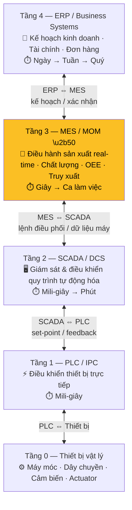
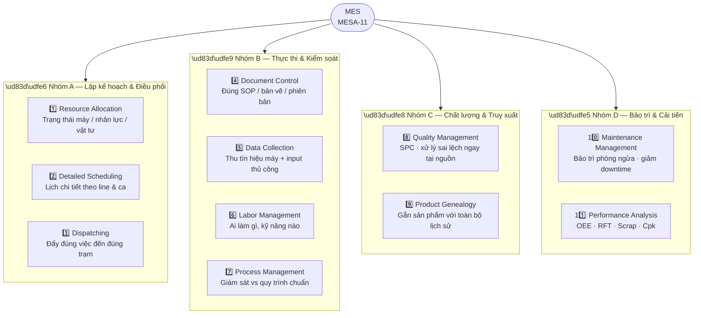

# 🏭 MES — Hệ Thống Điều Hành Sản Xuất (Manufacturing Execution System)

> Ghi chú tổng hợp về MES: định nghĩa, vị trí trong kiến trúc nhà máy (ISA-95), 11 chức năng cốt lõi, so sánh với ERP/SCADA, và liên hệ với hướng đi cá nhân (AOI, C#/WinForms, SQL Server).

---

## 1. MES là gì?

**MES = Manufacturing Execution System** (Hệ thống Điều hành / Thực thi Sản xuất).

- Là **phần mềm giám sát, theo dõi, ghi nhận và kiểm soát toàn bộ quá trình sản xuất theo thời gian thực** — từ nguyên vật liệu thô đến khi thành phẩm xuất xưởng.
- Đóng vai trò **cầu nối** giữa hai thế giới không nói chuyện trực tiếp được với nhau:
  - **Tầng trên (kế hoạch)**: ERP — quyết định "sản xuất **cái gì**, **khi nào**".
  - **Tầng dưới (máy móc)**: PLC/SCADA — điều khiển thiết bị theo mili-giây.

> 📌 **Định nghĩa cốt lõi:** *"ERP quyết định sản xuất cái gì và khi nào; MES ghi lại điều gì THỰC SỰ đã xảy ra ở từng công đoạn, ngay khi nó xảy ra. Khi hai bên mâu thuẫn, MES giữ bằng chứng."*

- Thuật ngữ ra đời **thập niên 1990**, khi ngành sản xuất nhận ra khoảng cách lớn giữa ERP (cấp quản lý) và SCADA/PLC (cấp vận hành). MES sinh ra để **lấp khoảng trống** đó.
- Tên tiếng Việt: **"Hệ thống Thực thi Sản xuất"** hoặc **"Hệ thống Điều hành Sản xuất"**.

---

## 2. Vị trí của MES — Mô hình ISA-95

Kiến trúc nhà máy chuẩn quốc tế **ISA-95** chia thành các tầng. MES nằm ở **Tầng 3 (Level 3)**.

| Tầng | Hệ thống | Chức năng chính | Nhịp thời gian | Người dùng |
|---|---|---|---|---|
| **Tầng 4** | **ERP** / Business Systems | Kế hoạch kinh doanh, tài chính, đơn hàng, mua sắm | Ngày → tuần → quý | Kế toán, mua hàng, sales |
| **Tầng 3** ⭐ | **MES / MOM** | Điều hành sản xuất real-time, chất lượng, truy xuất, OEE | Giây → ca làm việc | Giám sát, QC |
| **Tầng 2** | **SCADA / DCS** | Giám sát & điều khiển quy trình tự động hóa | Mili-giây → phút | Vận hành, bảo trì |
| **Tầng 1** | **PLC / IPC** | Điều khiển thiết bị trực tiếp | Mili-giây | — |
| **Tầng 0** | Thiết bị vật lý | Máy móc, dây chuyền, cảm biến, actuator | Real-time | — |

> ⚠️ **Nguyên tắc vàng:** Mỗi tầng **chỉ nói chuyện với tầng kề nó**, không nhảy cóc. ERP thò tay thẳng xuống PLC sẽ phá vỡ thiết kế và gây lỗi (brittleness).

---

## 3. Vì sao ERP không tự làm MES được?

Không phải vấn đề **năng lực**, mà là vấn đề **nhịp thời gian**:

- **ERP** thiết kế để **chính xác & kiểm toán được**, không phải chạy nhanh liên tục. Một lệnh sản xuất trong ERP là một "cam kết".
- **Trên sàn nhà máy**, lệnh đó là thứ "sống": tách ra, tạm dừng, đổi máy, hỏng vài sản phẩm rồi chạy tiếp.
- Nếu ép thực tế này vào ERP → xảy ra 1 trong 2:
  - Người ta dồn cuối ca mới nhập → **ERP "sai 8 tiếng"**.
  - Không ai cập nhật → ERP lập kế hoạch dựa trên số liệu **của hôm qua**.

👉 **MES hấp thụ sự biến động đó**, xử lý gọn, rồi trả cho ERP một xác nhận sạch: đơn này tiêu tốn bao nhiêu, làm ra bao nhiêu, mất bao lâu, chất lượng ra sao.

---

## 4. 11 Chức năng cốt lõi của MES (Mô hình MESA-11)

Do **MESA International** đưa ra năm **1997** (White Paper #6). Một MES chuẩn đáp ứng **11 chức năng**, chia **4 nhóm**.

### 🟦 Nhóm A — Lập kế hoạch & Điều phối
| # | Chức năng | Mô tả |
|---|---|---|
| 1 | **Resource Allocation & Status** | Biết trạng thái real-time từng máy, dụng cụ, vật tư, nhân công (đang chạy / bảo trì / chờ việc) |
| 2 | **Operations / Detailed Scheduling** | Lập lịch chi tiết theo line & ca, dựa trên năng lực thực tế |
| 3 | **Dispatching Production Units** | Đẩy đúng việc, đúng thứ tự, đến đúng trạm; điều chỉnh hàng đợi khi có sự cố |

### 🟩 Nhóm B — Thực thi & Kiểm soát
| # | Chức năng | Mô tả |
|---|---|---|
| 4 | **Document Control** | Đưa đúng hướng dẫn/bản vẽ/SOP tới nơi làm việc, đúng phiên bản, chặn tài liệu cũ |
| 5 | **Data Collection & Acquisition** | Thu tín hiệu máy tự động + input thủ công, gắn timestamp, gắn với lô/đơn hàng |
| 6 | **Labor Management** | Quản lý ai làm gì, với kỹ năng/chứng chỉ nào |
| 7 | **Process Management** | Giám sát thực thi so với quy trình chuẩn, cảnh báo lệch, ép đúng trình tự |

### 🟨 Nhóm C — Chất lượng & Truy xuất
| # | Chức năng | Mô tả |
|---|---|---|
| 8 | **Quality Management** | Kiểm tra, xử lý sai lệch, dùng SPC — chất lượng đảm bảo **ngay tại nguồn**, không kiểm sau |
| 9 | **Product Tracking & Genealogy** | Gắn mỗi sản phẩm/lô với **toàn bộ dữ liệu sản xuất** (từ nguyên liệu thô đến lắp ráp) |

### 🟥 Nhóm D — Bảo trì & Cải tiến
| # | Chức năng | Mô tả |
|---|---|---|
| 10 | **Maintenance Management** | Tối ưu bảo trì phòng ngừa, giảm downtime |
| 11 | **Performance Analysis** | Tính KPI: **OEE, RFT, Scrap, Cpk**... |

> ⚠️ Một phần mềm MES **không bắt buộc** làm đủ 11 chức năng — một số (như scheduling) có thể do ERP hoặc phần mềm chuyên biệt đảm nhận.

---

## 5. Phân biệt MES vs ERP vs SCADA

```mermaid
flowchart LR
    subgraph ERP["ERP — Tầng 4"]
        E1["Kế hoạch kinh doanh"]
        E2["Tài chính · Mua sắm"]
        E3["⏱️ Ngày → Quý"]
    end

    subgraph MES_box["MES — Tầng 3 \u2b50"]
        M1["Thực hiện lệnh sản xuất"]
        M2["Theo dõi chất lượng & OEE"]
        M3["⏱️ Giây → Ca làm việc"]
    end

    subgraph SCADA["SCADA — Tầng 2"]
        S1["Giám sát máy móc"]
        S2["Đọc cảm biến real-time"]
        S3["⏱️ Mili-giây → Phút"]
    end

    ERP <-->|"Kế hoạch\n/ xác nhận"| MES_box
    MES_box <-->|"Lệnh\n/ dữ liệu máy"| SCADA

    style MES_box fill:#fbbf24,color:#000
```

| Tiêu chí | **SCADA** (L2) | **MES** (L3) | **ERP** (L4) |
|---|---|---|---|
| Vai trò | Điều khiển **máy móc** | Điều hành **sản xuất** | Quản lý **kinh doanh** |
| Câu minh họa | *"Robot hàn 02 chạy 78°C, rung 4.8mm/s"* | *"Lệnh 4821 hoàn thành 67% trên Line 2, dùng lô B4455"* | *"Cần mua vật tư, xuất hóa đơn đơn hàng X"* |
| Nhịp thời gian | Mili-giây → phút | Giây → ca | Ngày → quý |
| Người dùng | Vận hành, bảo trì | Giám sát, QC | Kế toán, mua hàng |
| KHÔNG làm | Track đơn hàng, tính OEE | Đọc sensor trực tiếp, làm tài chính | Chạy tốc độ sàn nhà máy |

---

## 6. Lợi ích thực tế của MES

- **Tăng OEE**, giảm **downtime**, giảm **phế phẩm (scrap)**, rút ngắn **cycle time**.
- **Truy xuất nguồn gốc** đầy đủ — quan trọng khi thu hồi sản phẩm lỗi (biết ngay lô nào, máy nào, ca nào).
- **Số hóa giấy tờ**, giảm sai sót nhập liệu thủ công.
- Giải quyết bài toán **Q-C-D** (Quality – Cost – Delivery).
- Nâng cao tính **tuân thủ** (compliance) tiêu chuẩn ngành.

---

## 7. 🎯 Liên hệ với hướng đi cá nhân (AOI, C#/WinForms, SQL Server)

| Kiến thức đang học / quan tâm | Vai trò trong hệ MES |
|---|---|
| **AOI** (kiểm tra quang học) | Trạm **kiểm tra chất lượng**, feed dữ liệu lỗi vào MES (chức năng #8 Quality) |
| **C# / WinForms** | Xây **giao diện trạm / HMI** cho công nhân: thao tác, nhập liệu, xem lệnh sản xuất |
| **SQL Server** | Là **tầng database** của MES — lưu lệnh sản xuất, kết quả kiểm tra, truy xuất nguồn gốc |
| **QR-Code / Barcode** | Chức năng #9 (Genealogy) — quét mã, MES gắn toàn bộ lịch sử sản xuất |
| **REST API / kiến trúc 2-tier vs 3-tier** | MES thường nhiều tầng: trạm → API → database tập trung |
| **MQTT** | Giao thức phổ biến để MES **thu thập dữ liệu** từ máy (chức năng #5) |

> 💡 **Bức tranh lớn:** Một app WinForms + SQL Server kiểm tra AOI, ghi kết quả lỗi, gắn với lô hàng, hiển thị lệnh sản xuất... **chính là một module nhỏ của MES**. Học C#/WinForms/SQL cho nhà máy = xây dựng những **viên gạch** của một hệ MES.

---

## 8. Xu hướng MES hiện đại (2025–2026)

- **Cloud-based MES**: triển khai linh hoạt, dễ mở rộng, hợp cả SME.
- **Tích hợp AI / Smart Factory**: dự báo xu hướng, phát hiện bất thường, phản ứng tức thì.
- **IoT / IIoT**: thu thập dữ liệu tự động từ thiết bị kết nối.
- **Modular MES**: triển khai từng module, không cần "all-in-one" đắt đỏ.

---

## ✅ Tóm tắt nhanh

- **MES = hệ thống điều hành sản xuất real-time**, ở **Tầng 3 (ISA-95)**, cầu nối giữa **ERP (kế hoạch)** và **PLC/SCADA (máy móc)**.
- Định nghĩa bởi **11 chức năng MESA** (nguồn lực · lịch · điều phối · tài liệu · thu thập dữ liệu · nhân công · quy trình · chất lượng · truy xuất · bảo trì · hiệu suất).
- Khác ERP (kinh doanh) và SCADA (máy móc) ở **nhịp thời gian & phạm vi**.
- **AOI + C#/WinForms + SQL Server** chính là các thành phần xây nên một hệ MES.

---

*Ghi chú tham khảo — chuẩn MESA-11 & ISA-95. Dùng cho mục tiêu học phần mềm nhà máy (AOI / WinForms / SQL Server).*
