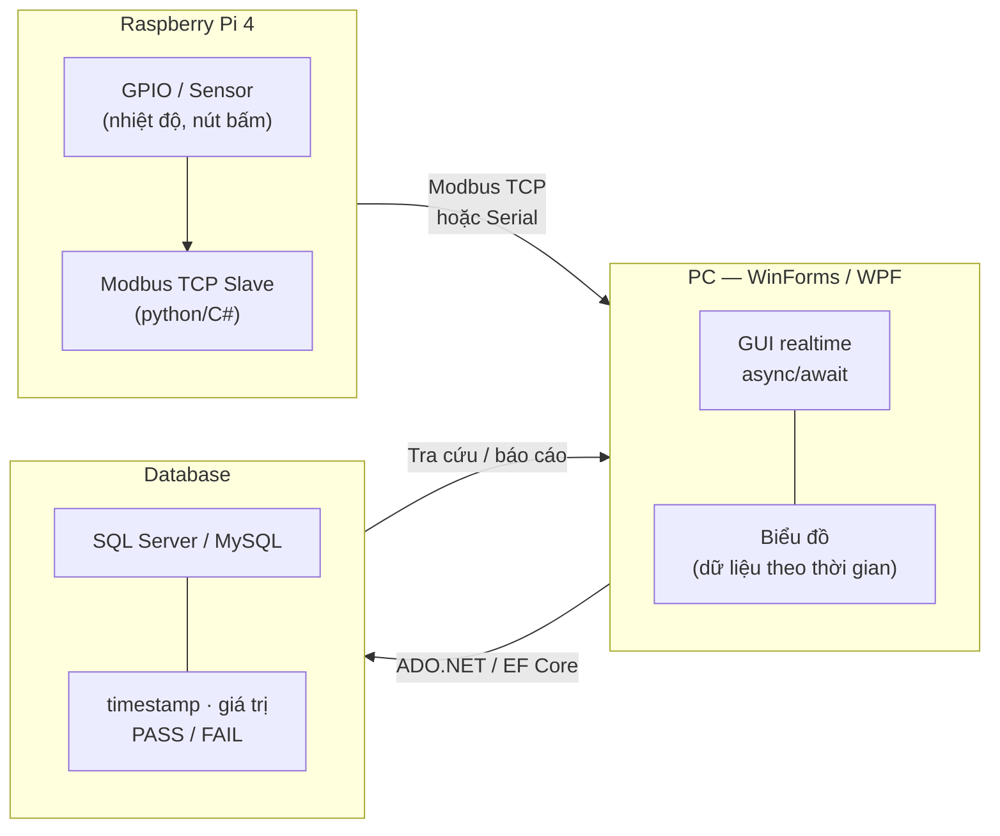

# Factory Study — C# cho Test Station nhà máy

## Mục tiêu
Học C# để xin việc tại nhà máy điện tử Đài Loan ở Nghệ An.  
Stack điển hình ở nhà máy: **WinForms/WPF GUI + Serial/Modbus/TCP + SQL Server/MySQL**.

## Công cụ
- **VS Code** + **.NET SDK** (dotnet CLI) — KHÔNG dùng Visual Studio Community
- Raspberry Pi 4 đóng vai thiết bị/PLC để luyện thật

---

## 🗺️ Lộ trình tổng quan

```mermaid
flowchart LR
    Goal(["🎯 Mục tiêu\nNhà máy điện tử"])

    subgraph P1["Phase 1 — 2–3 tuần"]
        P1A["C# nền tảng\nProperties · Interface\nEvent/Delegate · LINQ"]
        P1B["GUI\nWinForms → WPF"]
    end

    subgraph P2["Phase 2 — 1–2 tuần"]
        P2A["Async / Await\nTask · CancellationToken"]
        P2B["UI không freeze\nControl.Invoke"]
    end

    subgraph P3["Phase 3 — 2–3 tuần"]
        P3A["Serial\nRS232 / RS485"]
        P3B["TCP/IP Socket"]
        P3C["Modbus RTU/TCP\n★ quan trọng nhất"]
    end

    subgraph P4["Phase 4 — 1 tuần"]
        P4A["SQL Server / MySQL\nADO.NET → EF Core"]
        P4B["SQLite trên Pi"]
    end

    FP(["🏆 Final Project\nTest Station mini"])

    Goal --> P1 --> P2 --> P3 --> P4 --> FP
```



---

## Giai đoạn 1 — C# nền tảng + GUI (2–3 tuần)

> Folder: `phase1_csharp_gui/`

Tập trung vào **khác biệt so với C++**:

| Concept | Ghi chú |
|---|---|
| `properties` | Thay getter/setter của C++ |
| `interface` | Giống pure abstract class |
| `event` / `delegate` | Giống function pointer / callback |
| `LINQ` | Query collection kiểu SQL |
| `IDisposable` | Giống RAII — dùng cho port, file |
| `Garbage Collector` | Không cần `delete`, nhưng vẫn cần `Dispose` cho hardware resource |
| Generics | Giống template C++ |

**Thứ tự học GUI:**
1. **WinForms** — kéo thả nhanh, phù hợp test station → học trước
2. **WPF** — data-binding mạnh hơn, UI đẹp hơn → học sau

**Bài tập Phase 1:** Form có nút + textbox + label → bấm nút đọc giờ hệ thống và hiển thị.

---

## Giai đoạn 2 — Đa luồng / Async-Await (1–2 tuần) ⭐

> Folder: `phase2_async/`

Vấn đề cốt lõi: **đọc dữ liệu phần cứng liên tục mà không freeze UI**.

| Concept | Dùng khi nào |
|---|---|
| `async` / `await` | I/O không chặn: đọc serial, TCP |
| `Task` / `Task.Run` | Chạy việc nặng ở luồng nền |
| `CancellationToken` | Dừng vòng lặp đọc dữ liệu an toàn |
| `Control.Invoke` (WinForms) | Marshal về UI thread từ background thread |
| `Dispatcher` (WPF) | Tương tự, cho WPF |

**Bài tập Phase 2:** Vòng lặp `while` trong `Task` đọc dữ liệu mỗi 100ms, đẩy lên UI mượt, có nút Start/Stop dùng `CancellationToken`.

---

## Giai đoạn 3 — Giao tiếp phần cứng ⭐⭐

> Folder: `phase3_hardware/`

### Serial Port (RS232/RS485)
- `System.IO.Ports.SerialPort` — BaudRate, Parity, DataBits, StopBits, event `DataReceived`
- Luyện: nối PC ↔ Pi qua USB-to-TTL hoặc module RS485

### TCP/IP Socket
- `TcpClient` / `TcpListener` hoặc `Socket` mức thấp (giống BSD socket của C++)
- Luyện: server nhỏ trên Pi, client PC gửi lệnh

### Modbus RTU/TCP (quan trọng nhất ở nhà máy)
- Thư viện **NModbus** (MIT license) — vài dòng đọc/ghi holding register, coil
- Luyện: Modbus slave simulator trên Pi, PC làm master — đây là 100% công việc thực tế với PLC

### (Bonus) GPIO/SPI/I²C trên Pi bằng C#
- `System.Device.Gpio` + `Iot.Device.Bindings`
- Bài tập: nhấp nháy LED, đọc nút bấm

---

## Giai đoạn 4 — Cơ sở dữ liệu (1 tuần)

> Folder: `phase4_database/`

- **SQL cơ bản**: SELECT/INSERT/UPDATE/JOIN
- **SQL Server Express** (miễn phí) hoặc MySQL
- C#: **ADO.NET** (thuần, gần SQL) → **Entity Framework Core** (ORM)
- Trên Pi: dùng **SQLite** (nhẹ, không cần server)

---

## 🎯 Dự án tốt nghiệp — "Test Station mini"

> Folder: `final_project/`



| Layer | Vai trò |
|---|---|
| **Raspberry Pi 4** | Modbus TCP slave + đọc GPIO sensor |
| **PC — WinForms/WPF** | Kết nối Pi qua Modbus TCP/Serial, realtime async, biểu đồ |
| **Database** | Lưu mỗi lần đo: timestamp, giá trị, PASS/FAIL — có màn hình tra cứu |

Dự án này gần như **sao chép y hệt công việc thực tế** ở nhà máy điện tử Đài Loan → nhà tuyển dụng nhìn là hiểu ngay.

---

## Cài đặt môi trường

```bash
# 1. Cài .NET SDK (tải tại https://dotnet.microsoft.com/download)
# 2. Cài extension C# cho VS Code
dotnet new winforms -n MyApp   # Tạo project WinForms
dotnet run                     # Chạy project
```

VS Code extensions cần thiết:
- **C# Dev Kit** (ms-dotnettools.csdevkit)
- **C#** (ms-dotnettools.csharp)
