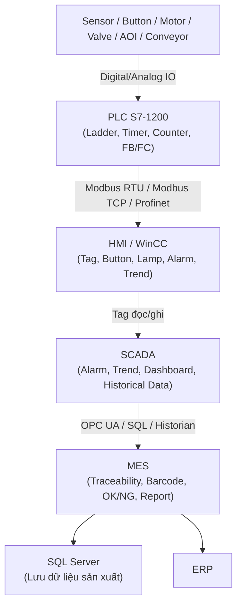

# Lộ trình học PLC / HMI / SCADA bằng YouTube tiếng Việt

Mục tiêu: học đủ nền tảng **PLC + HMI/WinCC + SCADA + truyền thông công nghiệp** để phục vụ hướng **MES / AOI software / C# + SQL Server trong nhà máy**. Không cần đi quá sâu theo hướng PLC engineer thuần.

---

## Sơ đồ khối tổng quan



---

## 1. PLC Siemens S7-1200 cơ bản

Mục tiêu: hiểu PLC nhận tín hiệu từ cảm biến, xử lý logic và điều khiển output như motor, đèn, van, xi lanh.

### Nguồn nên học

- [Lộ trình học lập trình PLC S7-1200 từ A-Z - T&T Automation](https://www.youtube.com/playlist?list=PLGAN0j3qDifFIxMkQMkVFu0Xoyu1HtD7B)
- [Khóa học lập trình PLC S7-1200 cơ bản - CPPS Automation](https://www.youtube.com/playlist?list=PLCpKYf0XQRczQ-5FxyAY4kek0f-KubNhV)

### Nội dung cần nắm

- TIA Portal là gì
- Cấu tạo PLC S7-1200
- Digital Input / Digital Output
- Vùng nhớ và kiểu dữ liệu
- Ladder cơ bản
- Timer
- Counter
- Analog Input / Output
- Function Block / Function
- SCL cơ bản nếu có thời gian

### Flow cần hiểu

```text
Sensor / Button
    ↓
PLC S7-1200 xử lý logic
    ↓
Motor / Lamp / Valve / Alarm
```

---

## 2. HMI / WinCC cơ bản

Mục tiêu: hiểu màn hình vận hành máy nói chuyện với PLC như thế nào.

### Nguồn nên học

- [WINCC/HMI Training - Nguyễn Văn Nguyên PLC](https://www.youtube.com/playlist?list=PLQrORGFKqbVyz8G-raT-GsvRGnWDntO-Q)
- [Khóa học thiết kế WinCC/HMI/SCADA cơ bản trên TIA Portal - Hội Quán PLC Việt Nam](https://www.youtube.com/watch?v=DzmM6EXzRSE)

### Nội dung cần nắm

- Tag trong WinCC
- Button Start/Stop
- Đèn hiển thị trạng thái
- Alarm cơ bản
- Trend / Data Log
- Gauge / Slider
- Chuyển trang màn hình
- Kết nối HMI với PLCSIM hoặc PLC S7-1200/S7-1500
- User Administration nếu có thời gian

### Flow cần hiểu

```text
PLC tag: Motor_Status
    ↓
HMI / WinCC đọc tag
    ↓
Operator thấy trạng thái motor ON/OFF
```

```text
Operator bấm Start trên HMI
    ↓
HMI ghi tag Start_Command xuống PLC
    ↓
PLC xử lý và bật motor
```

---

## 3. SCADA / WinCC

Mục tiêu: hiểu hệ thống giám sát cấp line/plant, gồm alarm, trend, dashboard, logging và historical data.

### Nguồn nên học

- [Bài 1: Tổng quan về WinCC, SCADA và ứng dụng trong công nghiệp - PLC AUTOMATION](https://www.youtube.com/watch?v=P5d9f-cAzZQ)
- [SCADA Playlist - ATX Central](https://www.youtube.com/playlist?list=PL9BQIUnkABl0twI1fmmY4mkhOHm22tf2a)

### Nội dung cần nắm

- SCADA khác HMI như thế nào
- Tag giám sát
- Alarm
- Trend
- Historical data
- Report cơ bản
- Giao diện giám sát hệ thống
- Mô phỏng trạng thái thiết bị: van, motor, xi lanh, bồn nước, băng tải

### Flow cần hiểu

```text
PLC
    ↓
WinCC / SCADA
    ↓
Alarm / Trend / Dashboard / Historical Data
```

---

## 4. Truyền thông công nghiệp

Mục tiêu: hiểu cách PLC, HMI, SCADA và MES/AOI software trao đổi dữ liệu với nhau.

### Nguồn nên học

Trong playlist T&T Automation, ưu tiên các bài về:

- Modbus RTU
- Modbus TCP/IP
- Profinet giữa 2 PLC
- Kết nối HMI với PLC
- Analog Input / Output

Link playlist:

- [Lộ trình học lập trình PLC S7-1200 từ A-Z - T&T Automation](https://www.youtube.com/playlist?list=PLGAN0j3qDifFIxMkQMkVFu0Xoyu1HtD7B)

### Nội dung cần nắm

- Modbus RTU là gì
- Modbus TCP/IP là gì
- Profinet là gì
- PLC giao tiếp với biến tần hoặc thiết bị ngoại vi như thế nào
- HMI/SCADA lấy dữ liệu từ PLC như thế nào
- MES/C# app thường không đọc sensor trực tiếp, mà lấy dữ liệu qua PLC/SCADA/OPC UA/SQL/Historian

### Flow cần hiểu

```text
Sensor / Device
    ↓
PLC
    ↓ Modbus / Profinet / OPC UA
SCADA / Gateway
    ↓
MES / C# App / SQL Server
```

---

## 5. Liên hệ với MES / AOI / C# / SQL Server

Với hướng software nhà máy, bạn không cần học PLC quá sâu ngay. Cái cần hiểu là dữ liệu từ máy móc đi lên tầng phần mềm như thế nào.

### Kiến trúc tổng quát

```text
ERP
 ↓
MES
 ↓
SCADA
 ↓
HMI / PLC
 ↓
Sensor / Motor / Robot / AOI / Conveyor
```

### Ví dụ với AOI

```text
AOI kiểm tra PCB
    ↓
Kết quả OK/NG gửi về PLC hoặc PC AOI
    ↓
SCADA hiển thị số lượng OK/NG, alarm, trạng thái line
    ↓
MES lưu traceability, barcode, lot, machine, operator, kết quả kiểm tra
    ↓
SQL Server lưu dữ liệu sản xuất
```

### Với C# developer

Bạn nên quan tâm nhiều đến:

- Giao tiếp dữ liệu với PLC/SCADA
- SQL Server
- Traceability
- Barcode / QR code
- OK/NG result
- Alarm/event log
- Report sản xuất
- Dashboard line status

---

## Thứ tự học đề xuất

### Giai đoạn 1: PLC nền tảng

```text
1. T&T Automation hoặc CPPS Automation
2. Học TIA Portal, project, PLC S7-1200
3. Học DI/DO, Ladder, Timer, Counter
4. Học Analog Input/Output nếu có thời gian
```

### Giai đoạn 2: HMI / WinCC

```text
1. Nguyễn Văn Nguyên PLC - WINCC/HMI Training
2. Học tag, button, lamp, alarm, trend
3. Học kết nối HMI với PLCSIM hoặc PLC
```

### Giai đoạn 3: SCADA

```text
1. PLC AUTOMATION - Tổng quan WinCC/SCADA
2. ATX Central - SCADA/WinCC project nhỏ
3. Tập trung alarm, trend, dashboard, mô phỏng thiết bị
```

### Giai đoạn 4: Truyền thông công nghiệp

```text
1. Modbus RTU
2. Modbus TCP/IP
3. Profinet
4. Hiểu thêm OPC UA ở mức concept
```

---

## Tỷ lệ học phù hợp với hướng MES/AOI software

```text
PLC S7-1200 cơ bản: 30%
HMI / WinCC: 30%
SCADA / Alarm / Trend / Logging: 25%
Truyền thông công nghiệp: 15%
```

---

## Ghi nhớ ngắn gọn

```text
PLC = điều khiển máy
HMI = màn hình vận hành máy
SCADA = giám sát line/plant
MES = quản lý sản xuất, traceability, report
AOI = kiểm tra chất lượng bằng camera/máy
SQL Server = lưu dữ liệu sản xuất
C# = viết app MES/AOI/dashboard/tool nội bộ
```
